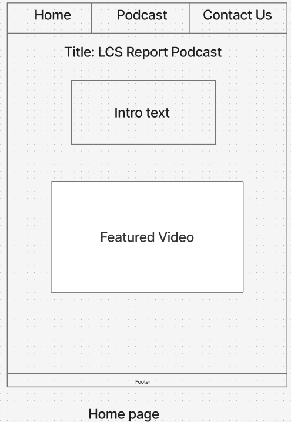
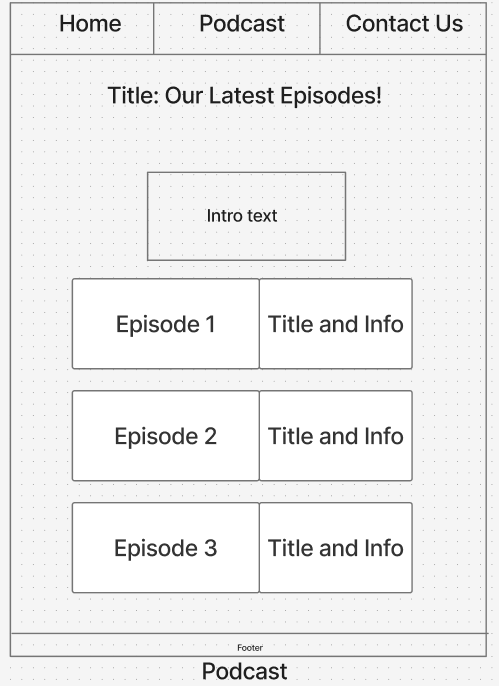
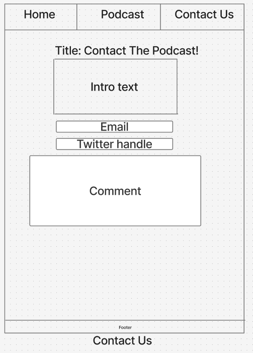
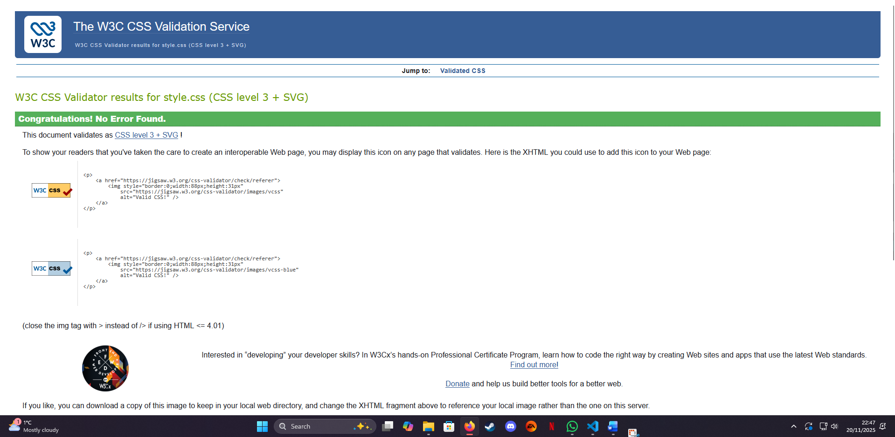
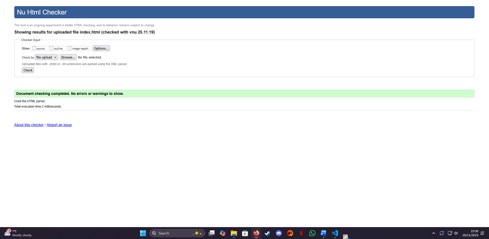
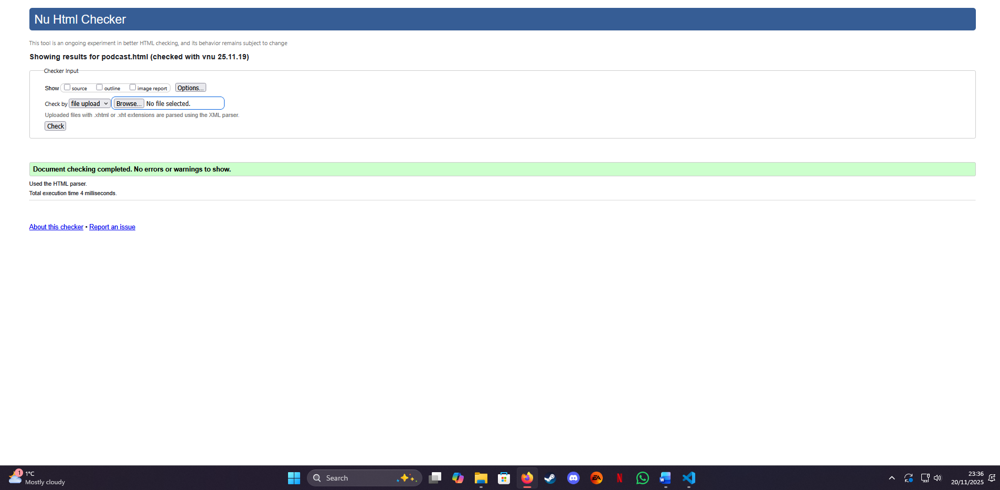

## Website design using wireframes
This website will be a simple yet effective website for my LCS Report podcast. This will give our audience a place to see all of our content under one roof. 

## Navigation bar + structured layout
The website will follow a simple three button navigation bar. This navigation bar will appear at the top of every page on the website, each button will link to the desired page you want to access. 

Each page will follow a simple layout that the audience can clearly navigate through without any difficulty. Here is how each page is structured. 

**Home page**: The homepage will have the heading at the top of the page underneath the navigation bar, followed by an introduction piece of text, welcoming the viewers to the website. Followed by the featured image below, this will be our most recent episode so you're never out of the loop.

**Podcast page** : This will be where the bulk of the content is displayed. Again below the navigation bar there will be a heading and an introduction block of text that will go over the page and explain about how this page will be updated in a timely fashion to accomodate the new episodes on the page.

Each episode will have an image that is hyperlinked to the podcast episode with a heading of the episode and a description next to it. 

**Contact us page**: This page is where the fans will get to contact the podcast to ask any burning questions, podcast feedback, and more. Below the navigation bar will be the heading asking them to please get in touch, with more information on when we can answer questions, what is allowed to be asked, and more. This is followed by a form with a simple email, twitter handle, and comment form.
Here is how each page will playout:

**Home**: 
- h1: LCS Report Podcast
- p: introduction text
- video:featured video block

**Podcast**
- h1: Our Latest Episodes!
- p : introduction text
- img:three image blocks that are hyperlinked to external pages.

Having the navigation bar in the same position helps the design remain consistent, making the website accessible for its users as the position of the navigation bar and its buttons will be in the same place. 

### Wireframe for the home page

### Wireframe for the podcast page

### Wireframe for the contact us page 

### How I will make my website accessible 
My website will be easy to read due to the stark contrast differences between the colors I will be using on the website. In the podcasts graphics on youtube, we use a darker blue background combined with golden borders, graphics etc. This will be the same for the website. I will use the same background image for the website, with the navigation bar being the same golden color used in the podcast itself.

All of my headings will be clear and easy to read. This is so that people that need to use screen readers will be able to quickly identify what is on the page. 

Every image where applicable will have accurate alternative text that informs the reader of what the image is about. When there is hyperlinks, the alternative text will describe the page they are going to rather as that is the reason they are hovering over the hyperlink in the first place.

The readers will have an easy time navigating my website because the navigation bar will remain the same position throughout, the buttons will not animate, and the colors will remain the same so the users have the same experience regardless of what page they are on. 

Going back to the background, it will be clear and not distract the users away from the website. 

Autoplaying videos are annoying, which is why every video on the website will have to be played manually. 

Font size and font used will be consistent throughout, making them both easy to read. 

### Organization
The information on every page will be displayed in a clear and precise manner. Underneat the navigation bar on each page of my website there will be a large h1/h2 clearly explaining what page you are on.

Because this is a podcast, these videos are prioritised to be placed higher on the pages where applicable. For example, the home page. The featured video will be displayed underneath the introduction paragraph, allowing for the audience to dive right into the content. 

To understand what page you are on even clearer, the button on the navigation bar will have a slight color change, indicating that this is the page you are on. Each hyperlink will go from one page to the next, meaning there is no broken navigation chain, you can go from page to page as many times as you want. 

All videos on the podcast page will open a popup video, these videos will not automatically play as this can become irritating to the spectating audience. 

When the user opens up the home page. They will know what the content is about immediately. Our opening paragraph and featured video will be the hook. So when they open the site, they will see the large navigation bar, then the introduction paragraph, followed by a large featured video.

Each page will follow a header, paragraph, and content formula. 

### CSS Validate

### index page validate

### podcast page validate
